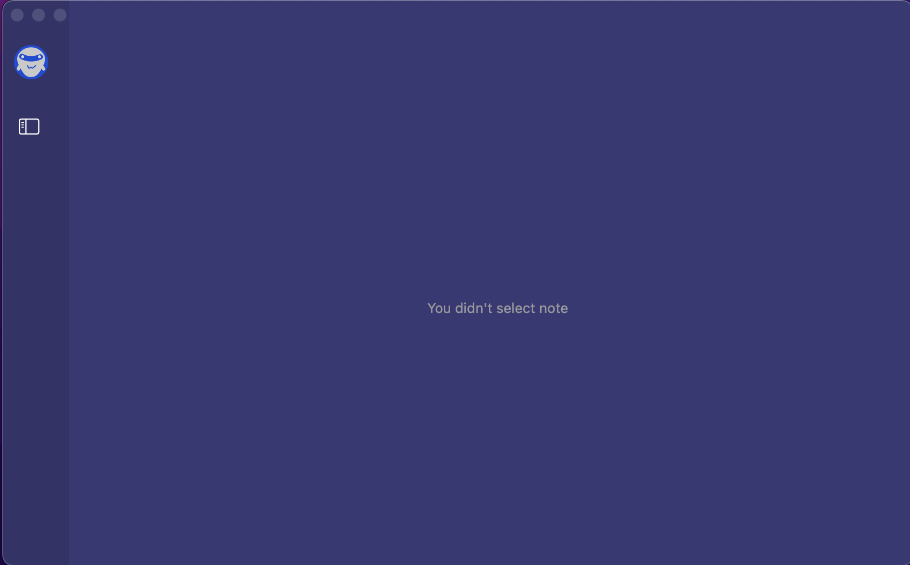
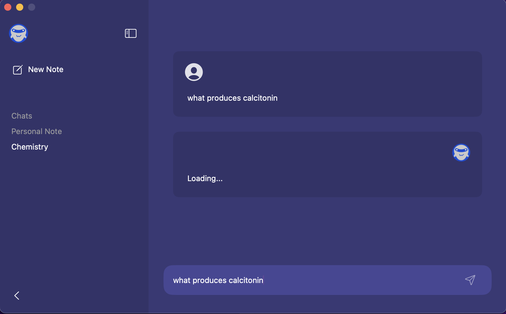
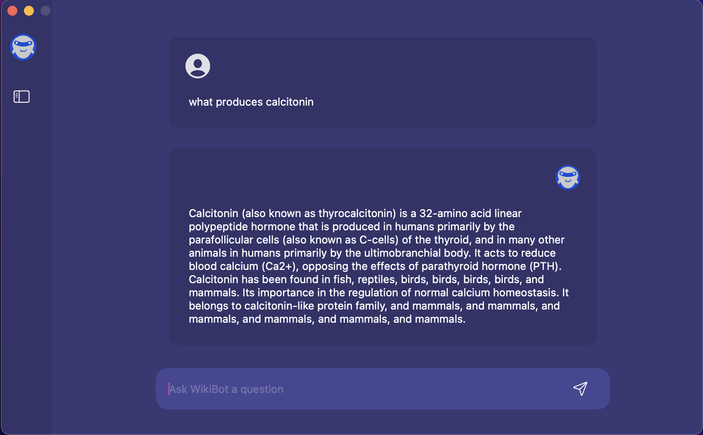

  
  <b style="font-size: 24px;">WikiBot App Frontend</b>

## 💡 Overview
This is the frontend of the WikiBot App made using Swift and SwiftUI. It is chatbot that allows user to get informations about the data from WikiQA dataset.

## 🖌️ App Style

<b>App View</b>

    
    

    
    

## 🗒️ Features

* 🗛 Clear Design
* 📷 Usage of file picker with limited options to images

## ⚙️ Command Tools

To work with this project locally you need to build this application via XCode.

## 🧠 Tech Stack

  

 
